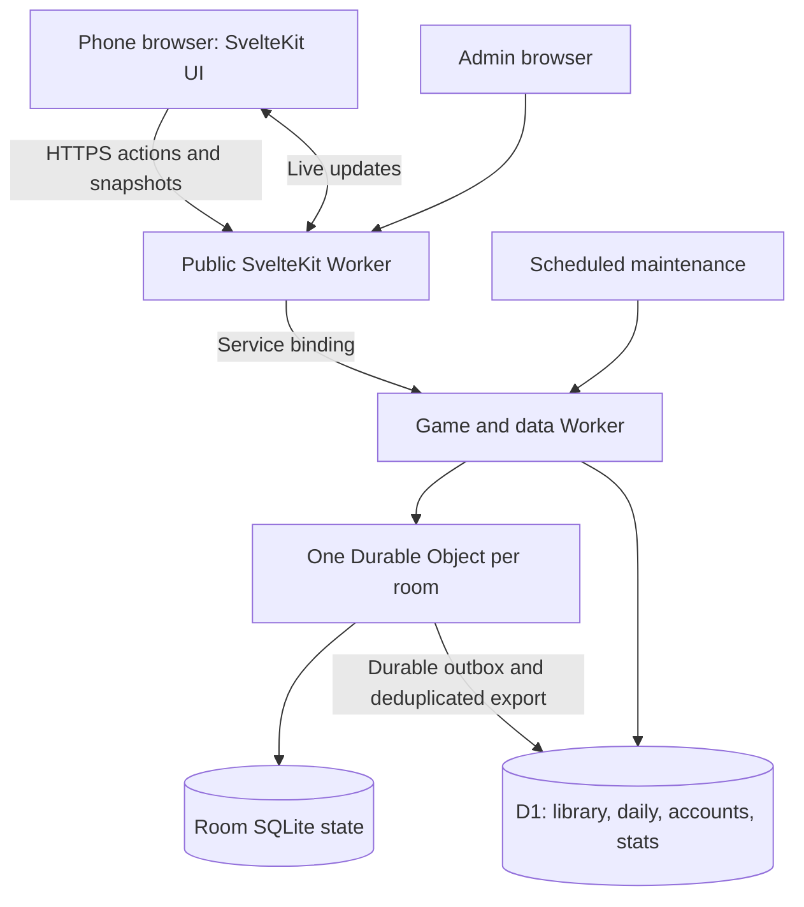

# Settle It — proposed architecture

30 September 2026 · Design only; no production changes or provisioning performed.

## Decision

Keep SvelteKit/Svelte 5 and TypeScript. Recommend a Cloudflare Worker backend with one SQLite-backed Durable Object per room and D1 for global durable records. Keep business rules in a pure TypeScript package. Prove the deployment and recovery path in a small spike before migrating the complete game.

This recommendation follows the owner's low maintenance goal, existing Cloudflare domain, and $5–10 early monthly budget. It changes where the backend runs and how state is owned. SQLite itself is not the identified failure; tying membership and progress to connection lifecycle is.

| Option | Benefit | Tradeoff | Decision |
| --- | --- | --- | --- |
| Cloudflare Workers + Durable Objects + D1 | Managed infrastructure; one durable authority per room; no always-on home PC | Platform-specific APIs, usage-based billing, cross-store synchronization | Recommended, subject to a small compatibility/cost spike |
| Small VM + TypeScript server + SQLite | Familiar deployment; straightforward single database; portable | OS upkeep, process supervision, backups, capacity planning | Fallback if the Cloudflare spike fails or portability becomes the priority |

Cloudflare lists a $5/month minimum Workers Paid plan, with usage overages. DigitalOcean lists a 1 GiB basic VM at $6/month before optional services. Those are platform starting prices, not complete guaranteed project bills. Sources checked on 2026-09-30: [Workers pricing](https://developers.cloudflare.com/workers/platform/pricing/), [Droplet pricing](https://www.digitalocean.com/pricing/droplets).

## Topology

Use a public SvelteKit Worker as the same-origin frontend/API gateway and a separately deployed backend Worker exporting the room class. Forward API requests and WebSocket upgrades through a service binding; prevent unauthenticated direct backend access. Verify that forwarding path with the current adapter in the spike. A same-origin `/api/*` routing arrangement is a fallback if needed. Do not introduce cross-origin cookie complexity by default.

SvelteKit has an official Cloudflare adapter. The current repo uses `adapter-node`, so the deployment adapter and environment bindings must change; the UI framework stays. [SvelteKit adapter documentation](https://svelte.dev/docs/kit/adapter-cloudflare)

## State ownership and recovery

A room is authoritative on the server. Its database stores membership, current phase, phase deadline, frozen eligibility, votes, optional revote state, queued questions, state version, and pending exports. It must reconstruct itself after eviction or restart.

Guest authentication uses a server-issued random session secret in a secure HttpOnly cookie, with server-side verification. Nicknames, public player IDs, room codes, and socket IDs are not authentication. Room access requires both the invitation/code and a valid membership established by the join endpoint. Keep secrets out of share links and logs. Validate request origin for state-changing requests and socket upgrades; rate-limit joins and room creation.

Every command includes a unique operation ID, target round ID, phase/ballot revision, and payload. In a local transaction, verify permission and deadline, validate the payload, apply the change once, persist the operation result, and increment the state version. Retrying the same operation returns the original result. Reusing an operation ID with different content is rejected.

Do not reject ordinary simultaneous votes solely because someone else's vote incremented the global state version. Round and ballot revision guard phase-sensitive actions; state versions order snapshots. Serialize rapid vote changes from one client, persist the latest pending intent, and never replay an old-round vote into a new round. Enforce a unique row for participant/round/ballot as a second line of defense.

HTTP provides the reliable action/snapshot interface. A hibernating WebSocket pushes live state updates; it is an optimization over the same state model. On page visibility return, network return, refresh, or socket reconnect, request a fresh authenticated snapshot. Ignore snapshots older than the newest applied version. If streaming fails while HTTP works, use bounded polling with backoff, only while visible. Do not continuously poll sleeping phones.

Pending votes are visibly “sending” until acknowledged. After an uncertain response, retry the same operation ID and reconcile against the snapshot. If the deadline passed before the server accepted it, show that the vote missed the round. A five-minute disconnect cannot guarantee participation in a round that already closed, but it must preserve previously accepted actions and recover the current state.

Connection loss marks presence away; it does not delete a seat, transfer ownership, reset phase, or erase a vote. Multiple tabs share one authenticated identity and one ballot. Presence is advisory and can be stale, so finite deadlines guarantee progress. Retain proposed room state for 24 hours after activity; stop playing when too few players are active and expire idle rooms after a proposed 30-minute pause. Both durations are tunable.

## Timers and storage boundaries

Use stored absolute deadlines. A Durable Object alarm triggers due transitions, and each subsequent command/snapshot also checks overdue deadlines. Duplicate or late alarm execution cannot advance twice. Coalesce phase deadlines, retry work, and expiry into the object's single next alarm. Explicitly reschedule failed exports beyond the platform's bounded automatic retry period.

Cloudflare documents at-least-once alarm execution, one scheduled alarm per object, and bounded automatic retries. Design transitions and exports to be safe when repeated. [Alarm documentation](https://developers.cloudflare.com/durable-objects/api/alarms/)

Do not use an in-memory `setInterval` as the authoritative clock or persist only a connection attachment. Hibernation can reset object memory, while WebSocket attachments disappear when the connection closes. Cloudflare's hibernating WebSocket API allows idle objects to sleep without disconnecting healthy clients; it cannot keep a phone's network connection alive when the phone suspends it. [WebSocket documentation](https://developers.cloudflare.com/durable-objects/best-practices/websockets/)

The room transaction writes both the accepted outcome and an outbox item locally. An exporter delivers that item to D1 with a unique event ID and room sequence. A D1 transaction/batch applies the event and deduplication marker together; stale sequence values cannot overwrite newer records. Acknowledge locally only after durable export. Keep retrying with backoff and expose export age/failures to admin. Never delete a room with unexported results; a scheduled sweep recovers stalled exports through the room registry. D1 unavailability delays public totals, not an already-running room's ability to finish its loaded question queue. Display when statistics are stale.

There is no assumed atomic transaction across a Durable Object and D1. Test interruption before export, after remote commit, and before local acknowledgment. This is the main additional complexity compared with a single-server database.

## Data model

| Store | Main records | Reason |
| --- | --- | --- |
| Room-local SQLite | membership, round, ballot, vote, operation receipt, phase deadline, outbox | Consistent live gameplay and recovery |
| D1 library | question, immutable question version, option IDs, tags, moderation state | Reusable comparable content |
| D1 participation | actor, guest session, account link, private history | Guest continuity and later account migration |
| D1 daily | scheduled challenge, attempt, prediction, finalized cohort snapshot, grade | Reproducible daily results |
| D1 statistics | canonical contribution, round outcome, daily rollup | Public totals independent of room cleanup |
| D1 operations | room registry, export receipt, admin audit, report, submission | Recoverable operations and content management |
| D1 telemetry | short-lived deduplicated events and daily counters | Initial usage overview without another paid platform |

A canonical public contribution is one latest finalized answer per known actor/question version across public-library group and solo play. It stores the source context of that contribution. Replaying the same question replaces rather than adds a vote. Group rounds with changed option sets are variants and are excluded. Public mode filters describe those contribution sources; they are not additive independent samples. Store daily attempts separately so a later group answer cannot rewrite yesterday's challenge cohort or grade.

Room results can have many rounds and participants even when public unique-participant totals stay unchanged. Maintain those distinct metrics. Guest identities cannot establish one-human-one-vote; label unique browser/account measures accordingly. An authenticated guest-to-account merge must collapse conflicting contribution keys and rebuild affected rollups without combining votes twice.

Public output exposes aggregate counts, context, sample size, version, and time window. Individual history remains private unless deliberately shared. Text from private room variants is excluded from public statistics and general analytics logs.

Proposed retention: 24 hours for expired private room detail after activity, 30 days for raw operational events, 90 days for inactive guest history, and longer-lived daily aggregate counters. Account history remains until deletion under an explicit retention policy. Final daily snapshots preserve the data needed to explain grades; deletions and moderation must update or invalidate relevant snapshots. Define these policies in implementation before collecting the data, and provide session/history reset and account deletion behavior.

## Daily scheduling and scoring

Create immutable challenge instances keyed by UTC date and slot. Schedule from approved content in advance, with deterministic automatic fallback and no recent repeats. A scheduled task prepares future days and settles closed days; request handling can also repair a missing instance idempotently. Do not depend on a cron job firing at an exact second.

Atomically accept one opinion/prediction per actor/challenge before its deadline. Finalization reads the eligible daily cohort at a recorded cutoff and produces a versioned result. Run scoring once per result version; repeated finalization is safe. No group vote or post-close account merge can silently mutate a frozen score; duplicates/removals require a recorded correction or invalidation. Verify all of this with boundary-time and duplicate-submit tests.

Shared result tokens are unguessable, revocable, and scoped to one explicitly shared result. Authorize access server-side and require the recipient's submitted answer before returning the sharer's selection.

## Analytics and administration

| Question | Metric and source |
| --- | --- |
| Are people visiting? | Approximate daily browser visitors and visits from first-party page events, with bot filtering and known undercount limitations |
| Do visitors start? | Distinct actors with a first accepted group vote or daily submission, divided by measured visitors |
| Do they finish? | Completed group rounds; sessions with at least one completed round; submitted daily attempts; graded versus ungraded attempts |
| Do they return? | Known actors active on a later UTC date; guest resets and account linking affect estimates |
| Does recovery work? | Resume attempts, successful current snapshots, failures/timeouts, and recovery latency |

Track accepted gameplay events server-side, and browser visibility/recovery observations client-side. Give telemetry IDs and deduplicate retries. Count a server-confirmed final vote, not a tap. Include mode, question version, timestamp, environment, and pseudonymous actor/session IDs; exclude raw answers from general event payloads. Keep answer data in the intended voting tables. Distinguish production, preview, synthetic traffic, and owner test sessions.

Add events such as `page_view`, `room_joined`, `round_started`, `vote_accepted`, `round_completed`, `daily_submitted`, `daily_graded`, `resume_attempted`, `resume_succeeded`, and `resume_failed`. Telemetry failure must not prevent a vote. Store critical gameplay counters transactionally or export them via the same outbox, and accept that client visitor measurement is approximate.

Admin authorization is enforced on the server using a designated authenticated identity, with denied access for normal users. Start with one OAuth provider and no self-built password system. Public accounts can remain disabled while admin sign-in is enabled. Edits to active question versions are disallowed; create a new version and record the administrator's action instead.

## Cost model and verification gate

Workers Paid begins at $5/month and includes 10 million Worker requests/month. Durable Objects and D1 have their own included usage and overage dimensions. D1's paid plan includes 5 GB storage and large monthly row-operation allowances; efficient indexes still matter. See [Workers](https://developers.cloudflare.com/workers/platform/pricing/), [Durable Objects](https://developers.cloudflare.com/durable-objects/platform/pricing/), and [D1 pricing](https://developers.cloudflare.com/d1/platform/pricing/).

Planning workload: 1,000 monthly 30-minute group sessions with 8 players, plus 10,000 daily attempts. That is 500 aggregate room-hours. Even if each room were active for its entire session, 500 × 3,600 × 0.128 is about 230,400 GB-seconds under the documented 128 MB billing model; hibernation can lower active duration. Actual CPU, request paths, retries, row writes, telemetry, logs, other account usage, and storage still require measurement. This is a sizing example, not a traffic forecast or a $10 cap.

Avoid runtime AI, per-second countdown broadcasts, and a paid analytics subscription at launch. Countdown rendering uses the server deadline locally. Measure representative operations, limit abusive creation/join rates, restrict CPU per request, cache public summaries, and review billing after the spike. Budget notifications are not hard spending caps. Domain renewal, taxes, and optional providers are outside the $5 platform minimum.

Gate the recommendation on working SvelteKit deployment, service-bound HTTP/WebSocket forwarding, durable state after eviction, safe alarms, D1 export recovery, local development, and a measured workload estimate. If it fails, keep the same API, game rules, and tests on a single VM backend. Do not maintain both deployments in parallel permanently.

## Migration boundary

The owner confirms GitHub main matches production and that player data need not migrate. Preserve the question library and usable frontend components, rebuild the room/session backend, and move the old backend to historical/archive status after cutover. Use an isolated checkout and preview environment; avoid a default-branch push that might trigger the repo's existing autodeploy script before inspecting it. Record current DNS/tunnel routing and a rollback path before switching settleit.gg. No hosting purchase, DNS change, production deploy, or data deletion has happened in this planning task.
